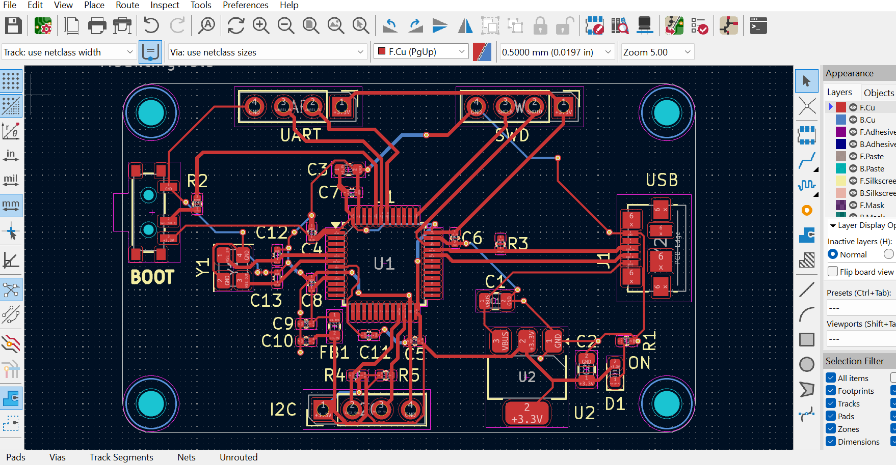
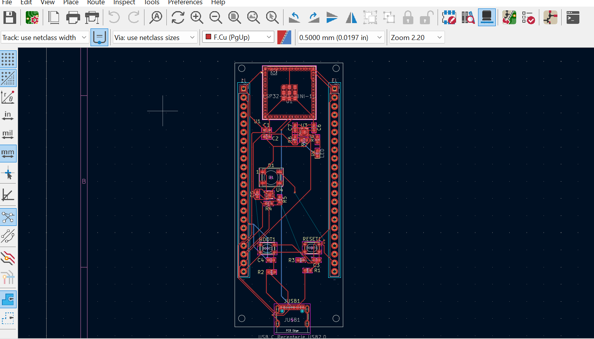
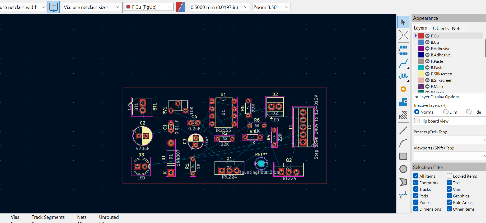
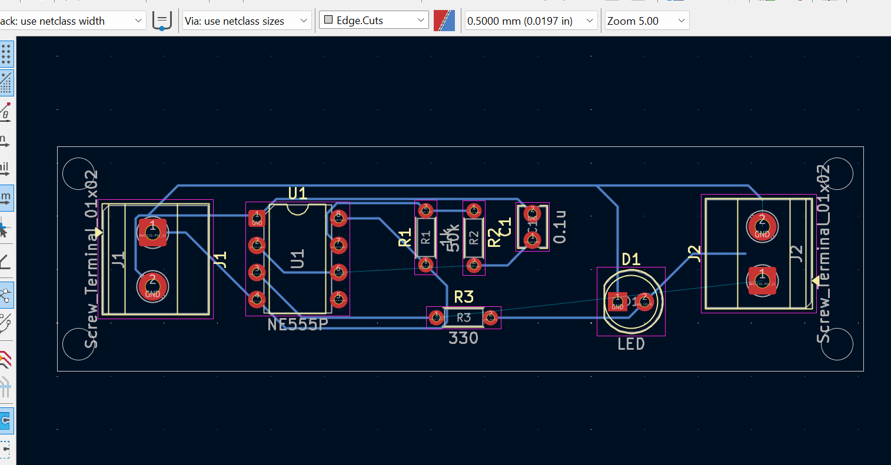

# My KiCad Projects

# My KiCad PCB Projects
.png)
# My KiCad PCB Projects

# My KiCad PCB Projects
.png)
# My KiCad PCB Projects

# My KiCad PCB Projects
.png)
# My KiCad PCB Projects

# My KiCad PCB Projects
.png)
